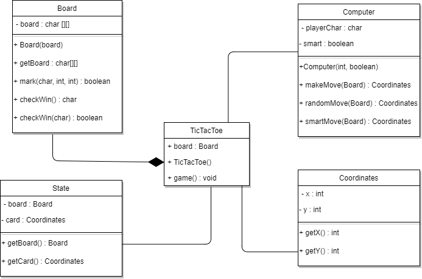
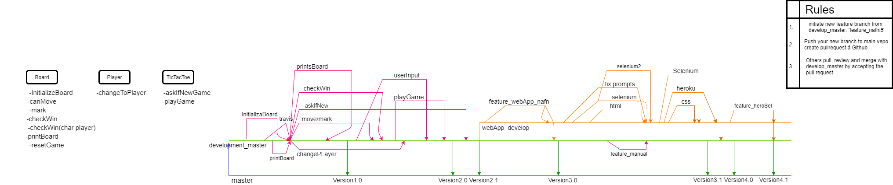

Design report
=============
Tic Tac Toe is a game coded in the JAVA language using Test Driven Development and Travis for Automated Continuous Integration Server.

Tic Tac Toe has four classes: Game, Board, Player and webGame

Below are the classes with it´s functions and main variables .

#### TicTacToe

    private Board gameBoard;
    private char playerX = 'x';
    private char playerO = 'o';
    public TicTacToe();
    public int getInputNumberFromUser();
    public void playGame();
    public void playGame(int number, Player player, char currPlayer)
    private void askIfNewGame();
    private void validateNewGameInput();

#### Board

    private char board[][];
    private int boardSize = 3;
    public Board();
    public void initializaBoard();
    public void printBoard();
    public char[][] getBoard();
    public boolean canMove();
    public boolean mark();
    public char checkWin();
    public boolean checkWin();
  
#### Player

    private char player;
    public player();
    public char currentPlayer();
    public void changeToPlayer();

   
#### webGame 

    public WebGame();
    public void newBoard();
    static int readPortOrDefault();
    public string playGame();

#### Class diagram

Below is a draft of a class diagram, created in the beginning of the project.

#### Development process(Git line)

Below is picture of the development process when creating the program. When creating new features, feature branches were made.
When specific features were completed, a pull request was made, for other team members to test and accept.
There were two main branches, the master branch which only containd complete versions of the program and
the development branch where the actual development took place, when starting the web development of the program, a sub branc feature_webApp
was created which included branches where the actual web development took place.

